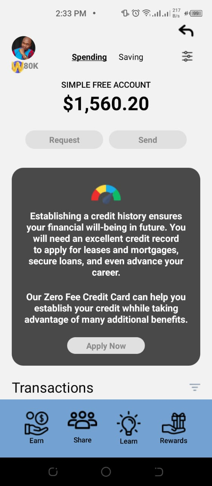
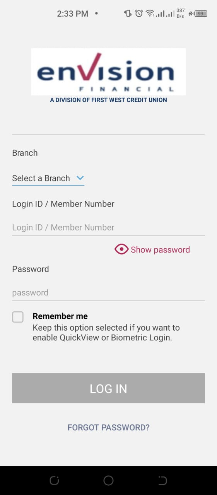
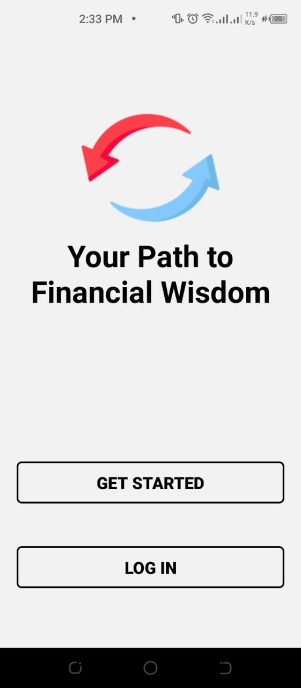

# Wizkid POC


This is a Proof of Concept financial application.

## Built With

- React
- React Native
- Jest
- React Test Renderer
- Redux


## App Screenshots
### Welcome Screen


### Login Screen


### Home Screen


## Getting Started
### Get A Local Copy And Run Application Locally
```bash
git clone https://github.com/CyberFuzzion/Wizkid-POC-Frontend.git

cd Wizkid-POC-Frontend

npm install

npm start

scan the QR with your android or iOS phone

```

## Test Application

```bash
npm test
```

## Author

👤 **CyberFuzzion**

- GitHub: [@githubhandle](https://github.com/CyberFuzzion)


## 🤝 Contributing

Contributions, issues, and feature requests are welcome!

Feel free to check the [issues page](https://github.com/CyberFuzzion/Wizkid-POC-Frontend/issues/).

## Show your support

Give a ⭐️ if you like this project!

## Acknowledgments
- A special thanks to the Wizkid team for giving us the opportunity to work on this project. We hope to continue working with you.

## 📝 License

This project is [MIT](./LICENSE) licensed.